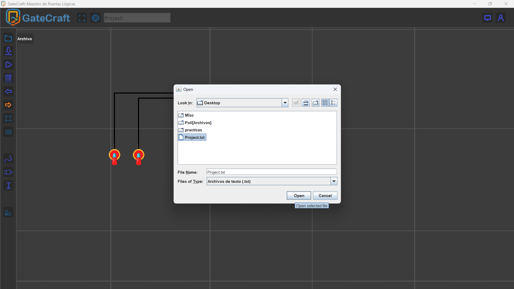
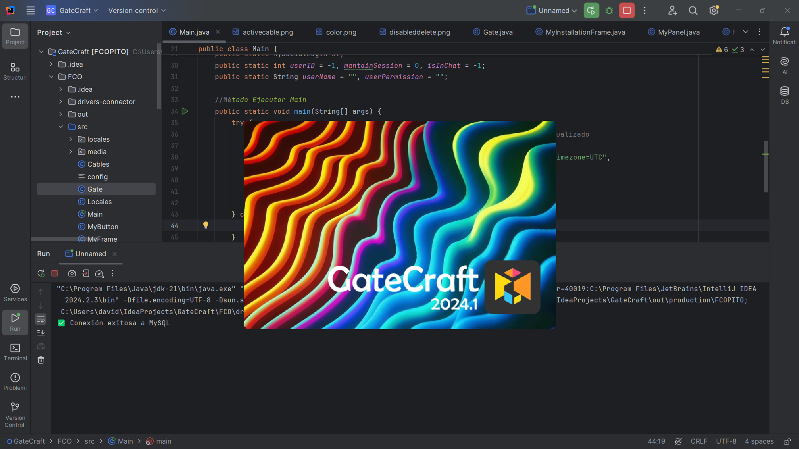
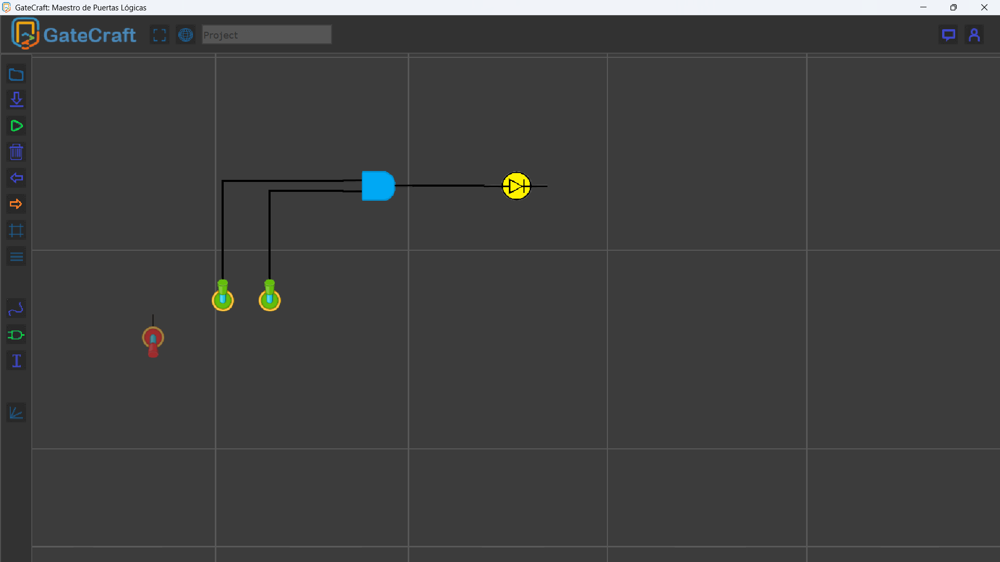
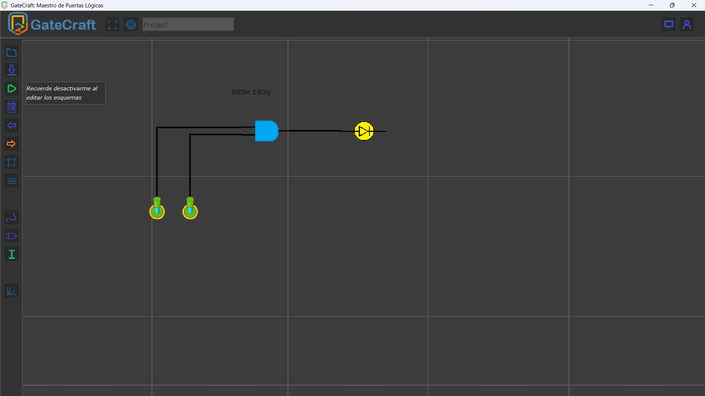

# GateCraft
GateCraft is the second release of GateCraft introducing a brand new and more efficient GUI with some new features.

# Project description
GateCraft: Logical Gates Master, is a fully functional Java application focused on your development of your skills in logical circuits and logical gates. You can develop your own circuits and export them to send them to your friends or teachers. With a brand new and more functional and intuitive GUI that will guide you through your development. 

This version features a new forum where you can discuss with other users and upload your projects, try your own circuits or even download other's code! This app comes in English and Spanish and introduces some other features such as alignment tool, color selection, admin panel, etc.

This version may be unstable and contain bugs, and if you want to try it you'll have to run the database locally, because at the moment, it isn't public because of its low amount of active users.

# Preview Video

  

# Unfinished features
Currently, as I stated before, it doesn't have a working global database and you'll have to run it locally, also, the forum is working but the upload isn't implemented yet. The circuits may have some bugs because of its poor quality of code (this was one of my first projects).

# Preview Images

   
  <em>Importing projects.</em>

   
  <em>Startup image.</em>

   
  <em>Adding elements.</em>

   
  <em>Running projects.</em>

# Used Technologies
Java Swing, Java, MySQL, Apache (for running MySQL database).

